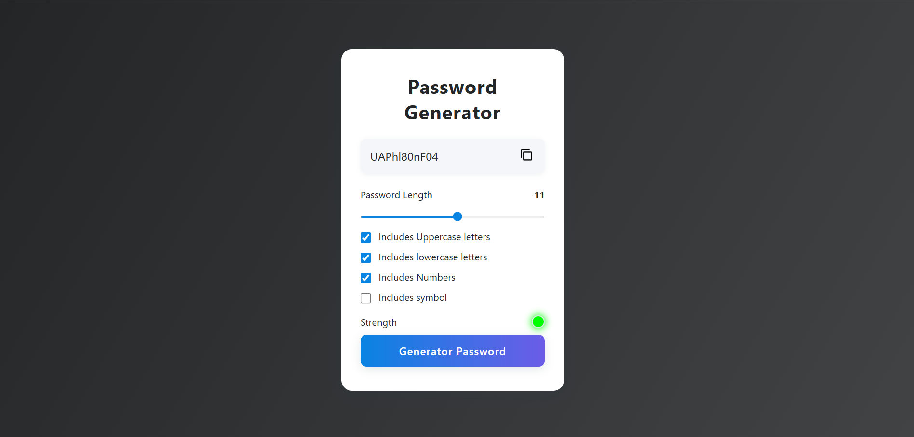

# Password Generator

A modern, responsive password generator web app built with HTML, CSS, and JavaScript.



## Features

- **Customizable Password Length:** Use the slider to set your desired password length (1–20).
- **Character Options:** Choose to include uppercase, lowercase, numbers, and symbols.
- **Password Strength Indicator:** Visual feedback on password strength (weak, medium, strong).
- **Copy to Clipboard:** Instantly copy the generated password with one click.
- **Responsive Design:** Looks great on both desktop and mobile devices.

## Getting Started

1. **Clone or Download this Repository**
2. **Open `index.html` in your browser**

No build steps or dependencies required.

## File Structure

```
password_generator/
│
├── index.html      # Main HTML file
├── style.css       # Professional CSS styling
├── script.js       # Password generation logic
├── copy.png        # Copy icon for UI
└── README.md       # Project documentation
```

## Usage

1. Select the desired password length using the slider.
2. Check the boxes for character types you want to include.
3. Click **"Generator Password"** to generate a new password.
4. Click the copy icon to copy the password to your clipboard.

## Customization

- You can adjust the color scheme and styles in `style.css`.
- The password generation logic can be extended in `script.js`.

## License

This project is open source and free to use.

---

**Made with ❤️ for learning and security.**